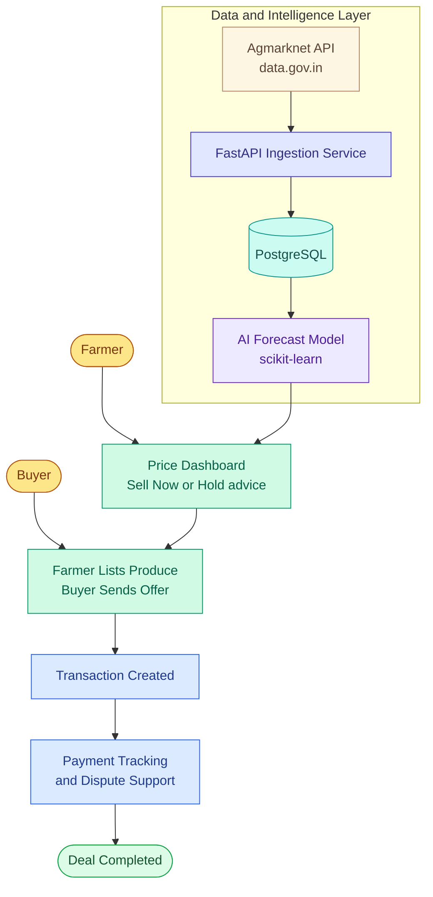

# KrishiMarket

**AI-Powered Price Intelligence & Direct Marketplace for Farmers**

Built for **Smart India Hackathon 2026** — Problem Statement **26132**: *"Strengthening market linkages and price discovery for farmers"* (Government of Maharashtra, Maharashtra State Innovation Society) · Theme: Agriculture, FoodTech & Rural Development · Category: Software

**Team Altis**

---

## The Problem

Farmers routinely sell their produce with almost no visibility into fair market prices, often under pressure from storage costs or immediate cash needs — pushing them into distress sales to the first available middleman. Research shows farmers typically keep only **33–37% of the final consumer price** for staple vegetables, and India loses an estimated **₹1.53 lakh crore a year** to post-harvest losses, much of it driven by rushed, uninformed selling rather than actual spoilage.

## The Idea

KisaanSetu combines three things existing platforms (like e-NAM) don't put together in one place:

1. **Live, real government price data** — pulled directly from the Government of India's Agmarknet API (data.gov.in), not estimates.
2. **AI-generated sell/hold advice** — not just "here's today's price," but a plain-language recommendation on whether to sell now or wait, based on a forecast model trained on real price history.
3. **A direct, verified marketplace** — farmers list produce, verified buyers send digital offers, and every deal is tracked transparently from offer to payment to delivery, with built-in dispute resolution if something goes wrong.

## Architecture



## Tech Stack

| Layer | Technology |
|---|---|
| Frontend | Next.js (App Router), TypeScript, Tailwind CSS, shadcn/ui — with multilingual `[locale]` routing |
| Backend | Python, FastAPI, SQLAlchemy, Alembic migrations |
| Database | PostgreSQL (Neon / Supabase) |
| AI / ML | pandas, scikit-learn — regression + moving-average price forecasting |
| Auth | JWT (python-jose, passlib) — farmer / buyer / admin roles |
| Real data | Government of India Agmarknet API (data.gov.in) |
| Payments | Razorpay (test/sandbox mode) |
| Multilingual voice | Bhashini (Govt. of India translation & speech API), with a Google Translate + browser Web Speech API fallback |
| SMS OTP | 2Factor.in |
| Push notifications | Firebase Cloud Messaging |
| File storage | Supabase Storage / AWS S3 (verification documents) |
| Hosting | Vercel (frontend), Render (backend) |

## Features

- ✅ Farmer / buyer / admin authentication (JWT)
- ✅ Live mandi price dashboard, synced daily from Agmarknet
- ✅ AI Sell Now / Hold price recommendation with a 7–14 day forecast
- ✅ Farmer produce listings (commodity, quantity, grade, asking price)
- ✅ Buyer marketplace with search/filter and digital offers
- ✅ Offer accept/reject → transaction creation
- ✅ Transaction view, correctly scoped per role (farmer sees buyer, buyer sees farmer)
- ✅ Mark-as-paid payment status flow
- ✅ Dispute raising (farmer/buyer) and resolution (admin), with a dedicated disputes page
- 🚧 Razorpay sandbox checkout replacing the manual "mark as paid" toggle
- 🚧 Bhashini-powered multilingual read-aloud recommendations (Hindi / Marathi / English)
- 🚧 SMS OTP login, Firebase push notifications, delivery/fulfillment tracking

*(Status checklist reflects the last known state during development — update it as features land.)*

## Getting Started

### Prerequisites
- Node.js 20+ and Python 3.11+
- A PostgreSQL database (a free one from [Neon](https://neon.tech) or [Supabase](https://supabase.com) works well)
- API keys for: [data.gov.in](https://data.gov.in) (Agmarknet), and optionally Razorpay, Bhashini, 2Factor.in, and Firebase for the features that use them

### Backend
```bash
cd backend
python -m venv venv
source venv/bin/activate        # Windows: venv\Scripts\activate
pip install -r requirements.txt
cp .env.example .env            # then fill in the values below
alembic upgrade head
uvicorn main:app --reload
```
Backend runs at `http://localhost:8000` — interactive API docs at `http://localhost:8000/docs`.

### Frontend
```bash
cd frontend
npm install
cp .env.example .env.local      # then set NEXT_PUBLIC_API_URL
npm run dev
```
Frontend runs at `http://localhost:3000`.

### Environment Variables

**Backend (`backend/.env`)**

| Variable | Used for |
|---|---|
| `DATABASE_URL` | PostgreSQL connection string |
| `SECRET_KEY` | JWT signing |
| `AGMARKNET_API_KEY` | Real mandi price data from data.gov.in |
| `RAZORPAY_KEY_ID` / `RAZORPAY_KEY_SECRET` | Payment sandbox checkout |
| `BHASHINI_USER_ID` / `BHASHINI_API_KEY` | Multilingual translation + voice |
| `GOOGLE_TRANSLATE_API_KEY` | Translation fallback |
| `SMS_API_KEY` | OTP auth via 2Factor.in |
| `FIREBASE_SERVICE_ACCOUNT_JSON` | Push notifications |
| `FILE_STORAGE_BUCKET_URL` / `FILE_STORAGE_ACCESS_KEY` | Verification document uploads (optional — local uploads work fine for a demo) |

**Frontend (`frontend/.env.local`)**

| Variable | Used for |
|---|---|
| `NEXT_PUBLIC_API_URL` | Points the frontend at the backend |
| `NEXT_PUBLIC_FIREBASE_CONFIG` | Firebase web app config for push notifications |

## API Overview

| Endpoint | Purpose |
|---|---|
| `POST /auth/register`, `/auth/login`, `GET /auth/me` | Authentication |
| `GET/POST /lots`, `PATCH /lots/{id}` | Farmer produce listings |
| `POST /offers`, `/offers/received`, `/offers/sent`, `PATCH /offers/{id}/accept\|reject` | Buyer offers |
| `GET /transactions`, `PATCH /transactions/{id}/payment-status` | Transaction tracking |
| `POST/GET /disputes`, `PATCH /disputes/{id}/resolve` | Dispute resolution |
| `GET /prices`, `GET /forecast` | Price data and AI recommendation |

Full interactive documentation is auto-generated by FastAPI at `/docs` once the backend is running.

## Deployment

- **Frontend:** deployed on [Vercel](https://vercel.com), connected to this repo's `frontend/` directory.
- **Backend:** deployed on [Render](https://render.com) as a web service from this repo's `backend/` directory. Note: Render's free tier spins down after 15 minutes of inactivity, so the first request after idle time takes 30–60 seconds to wake up — worth pinging the live URL a few minutes before any live demo.
- **Database:** hosted PostgreSQL via Neon or Supabase.

## References

- Problem Statement 26132 — Government of Maharashtra / Maharashtra State Innovation Society, SIH 2026 portal
- [Agmarknet mandi price data](https://www.data.gov.in/catalog/current-daily-price-various-commodities-various-markets-mandi) — data.gov.in
- RBI study on farmer price share (tomato/onion/potato) — via Business Standard
- Post-harvest loss data (NABCONS 2022 / ICAR-CIPHET) — Press Information Bureau
- e-NAM platform reach and statistics — Press Information Bureau, Govt. of India (March 2026)

## License

Not yet licensed — add a `LICENSE` file (MIT is a common, permissive default for hackathon projects) if you intend to make this repository public.

## Team

**Team Altis** — Smart India Hackathon 2026
